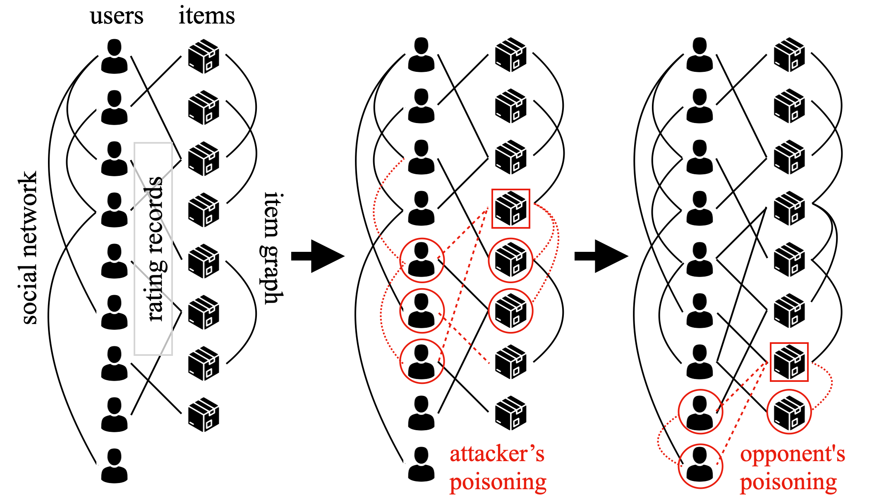

# MSOPDS
> source code for "Planning Data Poisoning Attacks on Heterogeneous Recommender Systems in a Multiplayer Setting" to appear ICDE 2023


We tackle the problem of Multiplayer Comprehensive Attack (MCA) where an attacker attempts to poison a Heterogeneous RecSys while anticipating subsequent oppoennts who also poisons the same RecSys. We solve MCA under a Stackelberg game framework.

Paper: [paper pdf](doc/camera_ready.pdf) to appear at ICDE 2023.

## Citation
If you find this work or code is helpful in your research, please cite our work:
```
@inproceedings{yeh2023planning,
  title={Planning Data Poisoning Attacks on Heterogeneous Recommender Systems in a Multiplayer Setting},
  author={Yeh, Chin-Yuan and Chen, Hsi-Wen and Yang, De-Nian and Lee, Wang-Chien and Yu, Philip S. and Chen, Ming-Syan},
  booktitle={2023 IEEE 39rd International Conference on Data Engineering (ICDE)},
  year={2023},
  organization={IEEE}
}
```

